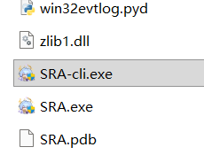

在 SRA 2.0 版本中，我们提供了一个独立的命令行程序 `SRA-cli.exe`，用于在命令行中执行 SRA 任务。



此应用程序是 SRA 的实际功能执行者，主程序通过嵌入式调用 SRA-cli 来完成任务。
因此，您可以直接使用 SRA-cli 来执行任务，而无需打开主程序。

:::tip 尽管如此，您仍需要先通过主程序配置好任务，SRA-cli 仅用于执行任务。
单独启动 SRA-cli 时，下列功能无法使用：

- 自动设置游戏分辨率
- 自动开启自动战斗
- 自动检测游戏路径
:::

## SRA-cli 的简单使用

运行 `SRA-cli`，即可看到 SRA-cli 的控制台窗口。
输入help查看可用命令：

```text
Welcome to SRA-cli (version 2.16.1, core 2.16.1 on win32).
Type 'help' to list commands.
sra> help

Documented Commands
───────────────────
alias  exit  history  notify  run         set    shortcuts  task     version
edit   help  macro    quit    run_script  shell  single     trigger

sra>
```

### 运行任务

使用 `task run [配置名称...]` 命令运行任务。
如果不指定配置名称，则默认运行**全部**配置。
可以指定多个配置名称，SRA-cli 会依次运行这些配置。
示例：运行名为 `Default` 和 `PlanB` 的配置：

```text
sra> task run Default PlanB
```

示例：运行全部配置：

```text
sra> task run
```

### 停止任务

使用 `task stop` 命令停止正在运行的所有任务。
示例：

```text
sra> task stop
```