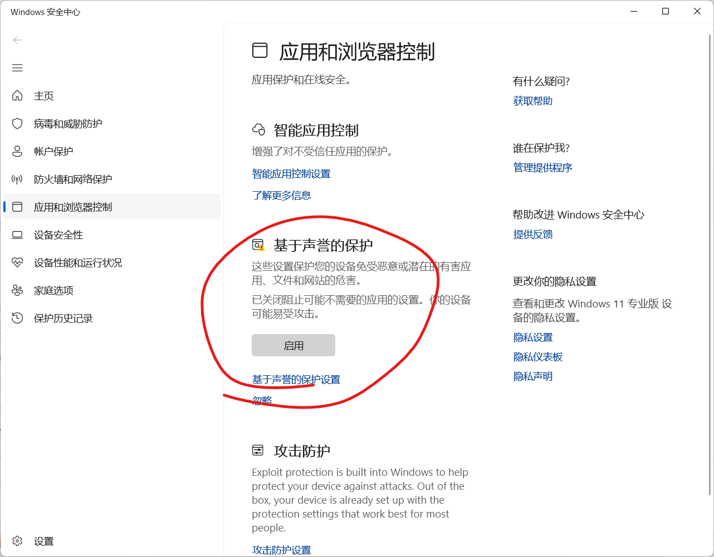
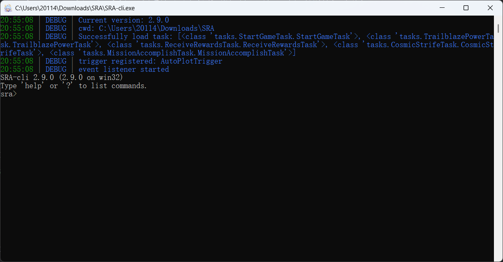
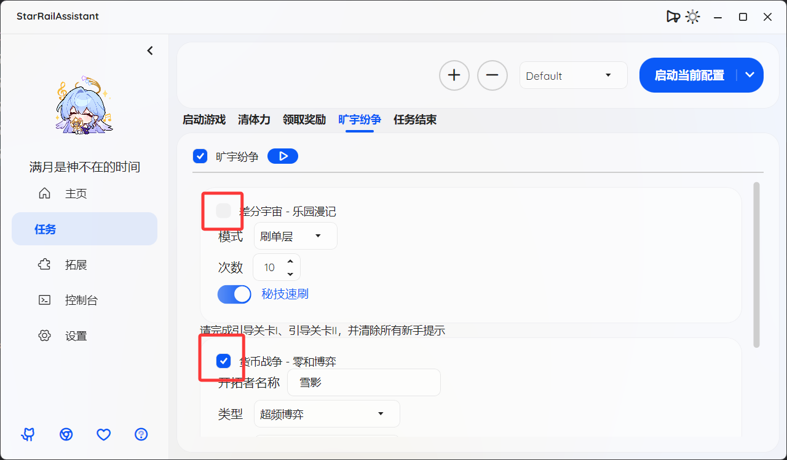
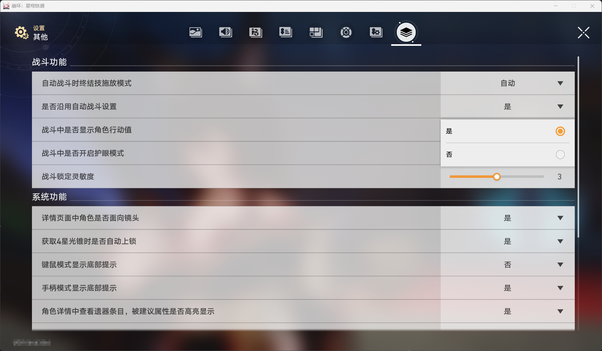

本页面目前只整理了最常见的问题，可能仍有遗漏。如果你的问题在这里没有找到，或者尝试后仍未解决，请前往官方群反馈。

## SRA 启动问题

### Windows Defender 阻止启动 | 恶意二进制信誉

特征：

- 控制台提示启动失败：An error occurred trying to start prosess "SRA-cli.exe" with working directory 'xxx'.
  应用程序控制策略已阻止文件。恶意二进制信誉

解决方法：

打开 Windows Defender（Windows 安全中心），在左侧选择“应用与浏览器控制”，将“基于声誉的保护”关闭。



---

### 打开来是一个黑色窗口 | 找不到 settings.json

特征：

- 打开后是一个 *黑色窗口*，里面有一堆带颜色的文字；
- 并且可能出现类似 `找不到 xxx\AppData\Roaming\SRA\settings.json` 的提示。

  

解决方法：
此问题通常出现在首次安装和启动 SRA 时。
请检查以下情况：
- 情况一：文件夹中同时存在 `SRA.exe` 和 `SRA-cli.exe`
    - 打开 `SRA.exe`，不要打开 `SRA-cli.exe`。
- 情况二：文件夹中只有 `SRA-cli.exe`
    - 你下载错版本了。如果下载的是 `StarRailAssistant_Core_版本号.zip` 或 `StarRailAssistant_Lite.zip`，请删除后改下载
      `StarRailAssistant_版本号.zip` 或 `StarRailAssistant_版本号_Setup.exe`。

---

### 未安装 `.NET Runtime` | You must install or update .NET to run this application.

特征：

- 打开 SRA.exe 提示 `You must install or update .NET to run this application.`

解决方法：
这是未安装 .NET Runtime 10 导致的。请安装 .NET Runtime 10 后重试。

点击 `Download it now`（或直接打开
https://dotnet.microsoft.com/en-us/download/dotnet/thank-you/runtime-10.0.7-windows-x64-installer
），在弹出的浏览器窗口中等待下载完成，然后运行安装程序。

---

### 其他无法启动问题 | 双击 SRA.exe 无法反应

特征：

- 双击 SRA.exe 无法反应，没有弹出窗口或控制台。

解决方法：
- 发送日志文件给开发者，通常位于 `C:\Users\xxx\AppData\Roaming\SRA\log\`。
- 如果无法找到日志文件，请与开发者联系。
- 尝试更新 Windows 更新。

## 任务执行问题

### 无法启动配置：请检查后端状态 | 未找到后端可执行文件 | 进程未运行

特征：

- 控制台提示启动失败：未找到后端可执行文件
- 运行任务提示无法启动配置：请检查后端状态
- 控制台提示发送失败：进程未运行（输入：task run Default）

解决方法：

- 可能是误下载了精简版。如果你下载的是 `StarRailAssistant_Lite.zip`，请删除后改下载 `StarRailAssistant_版本号.zip` 或 `StarRailAssistant_版本号_Setup.exe`。
- 可能是杀毒软件误杀了后端程序，请将 SRA 的目录添加到 Windows Defender 排除项，以及防病毒软件的信任区或开发者目录。
  将 SRA 整体文件夹添加信任 [点击此处查看](../getstarted/getstarted.html#添加信任) 然后重新解压压缩包。

---

### 刷本时无限滚动 | 找不到材料

特征：

- 刷本时进入材料选择界面后无限滚动

解决方法：

- 确认材料是否按“命途”排序，而不是“更新时间”排序。

### 截图失败 | Error code from Windows: 0 - 操作成功完成

特征：

- 任务执行时控制台 TRACE 日志显示 `Error taking screenshot: Error code from Windows: 0 - 操作成功完成`
- 游戏窗口任务栏图标闪烁

解决方法：

- 手动点击游戏窗口以激活窗口。此问题通常是因为 Windows 认为你当前正在使用 SRA 窗口，因此拒绝了 SRA 将游戏窗口置于前台的请求。

### 开始任务后立即结束

特征：

- 开始任务后，没有任何行为
- 控制台日志显示类似：

```text
20:57:30 | INFO  | Current config: Default
20:57:30 | INFO  | 旷宇纷争任务全部完成
20:57:30 | INFO  | All tasks in config 'Default' have been completed.
20:57:30 | INFO  | ==================================================
20:57:30 | INFO  | All tasks completed.
```

解决方法：

- 确认配置中是否勾选了任务。如果没有勾选任何任务，SRA 会认为所有任务已经完成，从而直接结束。
- 确认配置中大类任务中的子任务是否勾选。如果没有勾选任何子任务，SRA 会认为该大类任务已经完成，从而直接结束。
- 例如：
  

### 配置好了任务但不能执行 | Invalid task ID

特征：

- 控制台的报错信息中存在 `Invalid task ID`

解决方法：

- 尝试重新添加任务。
- 如果仍无法执行，尝试新建配置。

---

### 差分宇宙/货币战争不能执行

特征：

- 点击开始任务后，没有任何行为

解决方法：

- 检查 **旷宇纷争** 大类是否勾选。
- 检查 **开拓者名称** 是否填写。
- 检查是否在差分宇宙界面执行。
- 检查分辨率是否为 1920 × 1080，并参考“图片识别失败”相关问题。

---

### 战斗时卡住/无法自动战斗

特征：

- 刷本时进入战斗后停住不动
- 差分宇宙/货币战争时进入战斗后停住不动

解决方法：

- 游戏设置中，**其他** -> **战斗功能** -> **是否沿用自动战斗设置**：**是**，然后手动开启自动战斗（如果之前没开过的话）。
  

### 图片识别失败

特征：

- 控制台的报错消息包含 `OCR识别结果为空` 或 `Could not locate the image`，**从而导致任务失败**

解决方法：

**对于连接了多台显示器的用户**：
- 将 SRA 和游戏都放在主屏幕上。
- 或拔掉一块屏幕，
- 或者在设置中改为镜像屏幕或仅在 1 / 2 中显示。

**对于所有任务**：

- 检查游戏的分辨率是否为 1920 × 1080。

**对于旷宇纷争**：

- 可能没在指定页面开始任务，请检查 [特定要求](../getstarted/getstarted.html#模拟宇宙)。

---

### 找不到游戏

特征：

- 控制台的报错信息中存在 `No such file or directory`
- 游戏不启动时无法正常执行任务，启动时可以正常执行任务

解决方法：

第一种方案：

- 在任务页中，通过游戏路径右侧的全局设置打开。
- 在设置页面中开启游戏路径自动检测；或者关闭自动检测，手动选择文件夹。

第二种方案：

- 在任务页中设置或重新设置游戏路径。
