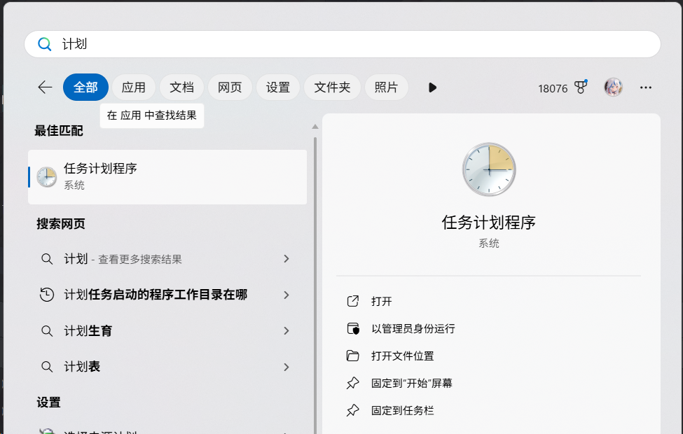
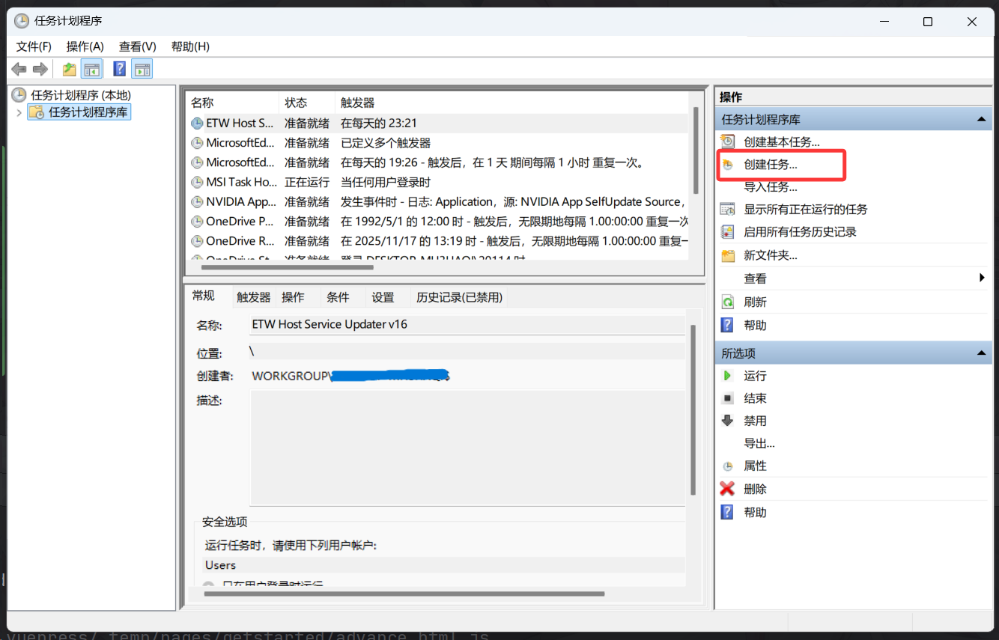
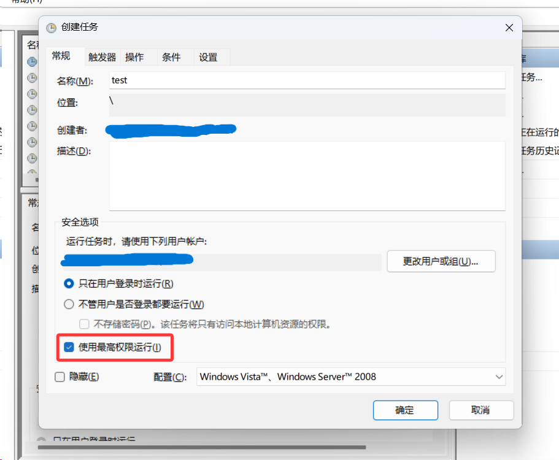
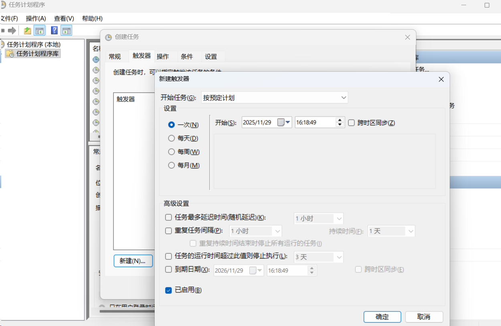
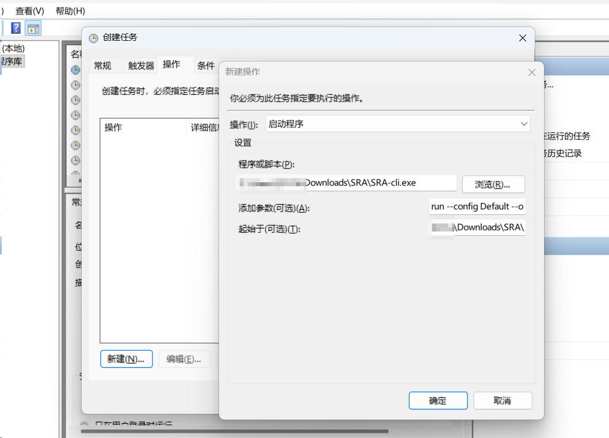

import { Steps } from "@astrojs/starlight/components";

由于 SRA 启动时需要管理员权限，因此无法有效地将 SRA 设置为启动项开机自启。

为了实现开机自启，可以使用 Windows 计划任务程序来启动 SRA-cli。

<Steps>
1. 按下您键盘上的Windows徽标键，搜索“任务计划程序”，并打开它。
   

2. 点击创建任务，填写任务名称，例如“SRA自动运行”。
   

3. 注意勾选“使用最高权限运行”，以确保SRA-cli能够正常运行。
   

4. 点击触发器，设置任务的触发条件，例如“在登录时”或“按计划”。
   

5. 点击操作，添加一个新操作，选择“启动程序”。
   

   在“程序或脚本”栏中，填写SRA-cli的完整路径，例如 `C:\Program Files\SRA\SRA-cli.exe`。

   在“添加参数”栏中，填写运行命令，例如 `run --config Default --once`。

   在“起始于”栏中，填写SRA-cli的安装目录，例如 `C:\Program Files\SRA`。
</Steps>