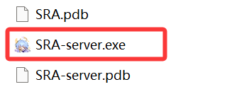

SRA-server 是 SRA 的 Web API 服务端，在 SRA 运行时提供一个 HTTP 服务器，允许其他程序通过 HTTP 请求来控制 SRA 运行。

基于 ASP.NET Core 构建，内置 Swagger UI 文档和 MCP（Model Context Protocol）支持。



## 启动服务端

运行 `SRA-server.exe` 即可启动 HTTP 服务器。

```bash
SRA-server.exe
```

服务器默认监听端口为 `5000`，启动后可通过浏览器访问 `http://localhost:5000` 查看 Web UI。

:::tip
启动后 Swagger API 文档可在 `http://localhost:5000/swagger` 访问。
:::

### 自定义端口

使用 `--urls` 参数指定监听地址和端口：

```bash
SRA-server.exe --urls http://0.0.0.0:8080
```

这将启动一个监听端口为 `8080` 的 SRA HTTP 服务器。您可以同时指定多个地址：

```bash
SRA-server.exe --urls "http://0.0.0.0:5000;http://0.0.0.0:8080"
```

### 其他启动参数

| 参数 | 说明 |
|------|------|
| `--urls <地址>` | 指定监听地址和端口 |
| `--no-webui` | 跳过 Web UI 静态文件服务，仅提供 API |
| `--use-python` | 强制使用 Python 后端而非 CLI 后端 |

示例：仅启动 API 服务，不加载前端 UI：

```bash
SRA-server.exe --no-webui --urls http://0.0.0.0:8080
```

## 快速体验

启动服务端后，您可以通过 curl 快速验证服务是否正常工作：

### 获取任务状态

```bash
curl http://localhost:5000/api/Task/status
```

### 运行任务

```bash
curl -X POST http://localhost:5000/api/Task/run \
  -H "Content-Type: application/json" \
  -d '{"configName": "Default"}'
```

### 停止任务

```bash
curl -X POST http://localhost:5000/api/Task/stop
```

### 查看后端日志

```bash
curl http://localhost:5000/api/Backend/logs?count=50
```

## 基本架构

SRA-server 本身是一个中间层，它管理一个后端进程（SRA-cli 或 Python）并通过 stdin/stdout 与之通信。工作流程如下：

1. SRA-server 启动并监听 HTTP 请求
2. 后端进程在首次请求或手动启动时按需启动
3. HTTP 请求被转换为 CLI 命令发送给后端进程
4. 后端进程的输出通过 API 或 SSE 日志流返回给客户端

```text
┌─────────────────┐       HTTP        ┌──────────────────┐
│  外部程序 / 客户端 │  ──────────────>  │   SRA-server     │
│  (curl, 浏览器等)  │  <──────────────  │  (ASP.NET Core)  │
└─────────────────┘                   └────────┬─────────┘
                                               │ stdin/stdout
                                       ┌───────▼─────────┐
                                       │   SRA-cli.exe   │
                                       │   (后端进程)     │
                                       └─────────────────┘
```

## 启用认证

默认情况下 SRA-server 不需要认证。如需保护 API 访问，可以在 `appsettings.json` 中设置 `AccessToken`：

```json
{
  "AccessToken": "your-secret-token-here"
}
```

设置后，所有 API 请求都需要携带 Token。详见 [认证](/server/authentication) 文档。

:::warning
生产环境中强烈建议启用认证，特别是当 SRA-server 暴露在公网时。
:::
