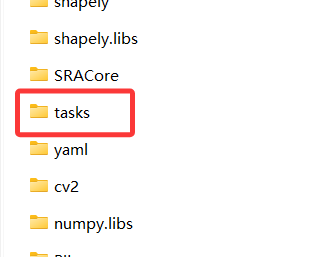
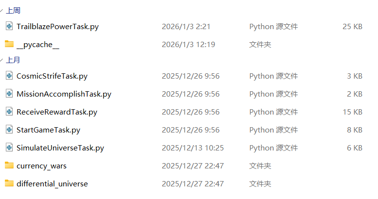

import { Steps } from "@astrojs/starlight/components";

## 在 SRA 中添加自定义任务

本章节介绍如何在 SRA 中添加一个自定义任务。

### 先决条件

- 已安装 SRA 或已获取 SRA 源码
- 了解 Python 编程基础
- 文本编辑器（如 VSCode、Notepad++）

### 分步教程

<Steps>

1. 打开 SRA 的安装目录或源码目录，找到 `tasks` 文件夹。
   
   这里存放了所有的任务脚本。
   
2. 创建一个新的 Python 文件，例如 `MyCustomTask.py`。
3. 在文件中编写任务代码，例如：
   ```python
   from SRACore.task import BaseTask, task
   from SRACore.util.logger import logger

   @task
   class MyCustomTask(BaseTask):
   def run(self):
   logger.info("这是我的自定义任务！")
   ```
   解释：
   这是一个简单的任务类，继承自 `BaseTask`，并实现了 `run` 方法，在运行时会打印一条日志信息。
   - `from SRACore.task import BaseTask`：导入任务基类。
   - `from SRACore.util.logger import logger`：导入日志记录器。
   - `class MyCustomTask(BaseTask):`：定义一个新的任务类。
   - `def run(self):`：实现任务的主要逻辑。
   - `logger.info("这是我的自定义任务！")`：打印日志信息。
   - `BaseTask` 类是所有任务的基类，必须继承它才能被 SRA 识别为任务。
   - `BaseTask` 要求实现 `run` 方法，作为任务的入口点。
   - `@task` 装饰器将任务注册到 SRA 中，使其能够被识别和调用。

4. 注册任务：
   无需手动修改任何注册代码，SRA 会自动扫描 `tasks` 文件夹中的所有 Python 文件（不包括子文件夹中的），并将其中定义的任务类注册到系统中。
   只要你的任务类正确地继承自 `BaseTask` 并使用 `@task` 装饰器，它就会被 SRA 自动识别和加载。

5. 测试你的任务类：
   在进行下一步之前，确保你所有的修改都已保存。
   运行 SRA：

   - 如果你使用的是安装的 SRA，请在 SRA 安装目录下找到 `SRA-cli.exe` 并运行它。
   - 如果你使用的是源码，请参考前面的章节了解如何运行 SRA。

    如果一切正常，你应该能在 SRA-cli 中看到你的自定义任务已被加载，得到类似如下的输出：
  
    ```text
    DEBUG | Successfully load task: [
    class 'tasks.StartGameTask.StartGameTask',
    class 'tasks.TrailblazePowerTask.TrailblazePowerTask',
    class 'tasks.ReceiveRewardsTask.ReceiveRewardsTask',
    class 'tasks.CosmicStrifeTask.CosmicStrifeTask',
    class 'tasks.MissionAccomplishTask.MissionAccomplishTask',
    class 'tasks.MyCustomTask.MyCustomTask'>
    ```
  
    SRA 会打印出已加载的任务列表，其中应包含 `MyCustomTask`，你的任务已成功注册，它的索引为 5.
  
    在 SRA-cli 中，运行以下命令来执行你的自定义任务:
  
    ```text
    task single 5
    ```
  
    或者
  
    ```text
    task single MyCustomTask
    ```
  
    你应该能在控制台看到日志输出：
  
    ```text
    sra> task single 5
    12:28:40[7916] | DEBUG | [Start]
    12:28:40[7916] | DEBUG | run single task: config=Default, task=5
    12:28:40[7916] | DEBUG | config: ...
    12:28:40[7916] | DEBUG | running task: MyCustomTask
    12:28:40[7916] | INFO | 这是我的自定义任务！
    12:28:40[7916] | ERROR | 任务 'MyCustomTask' 失败。停止进一步执行。
    12:28:40[7916] | DEBUG | [Done]
    sra>
    ```
  
    这表示你的任务已成功运行。
    你可能注意到日志中有一条错误信息 `任务 'MyCustomTask' 失败。停止进一步执行。`，这是因为我们没有在任务执行完成后返回成功状态。
    
    在 `run` 方法的末尾添加以下代码以返回成功状态：
  
    ```python
    return True
    ```
  
    现在再次运行任务，你应该不会再看到错误信息。

6. 恭喜！
   你已经成功创建并运行了一个自定义任务！如果想实现更复杂的功能，可以参考 SRA 的其他任务脚本，和 SRA 提供的 API
   文档。

</Steps>