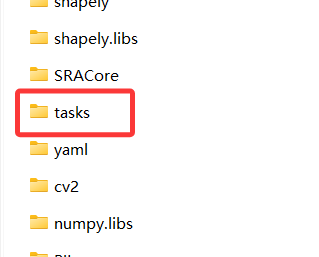
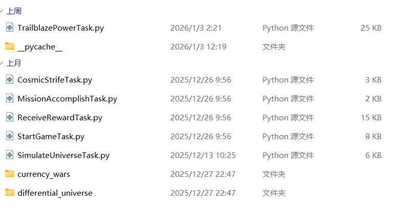
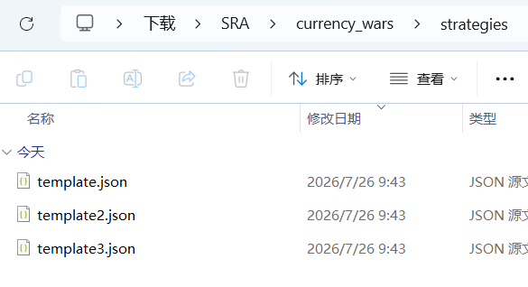
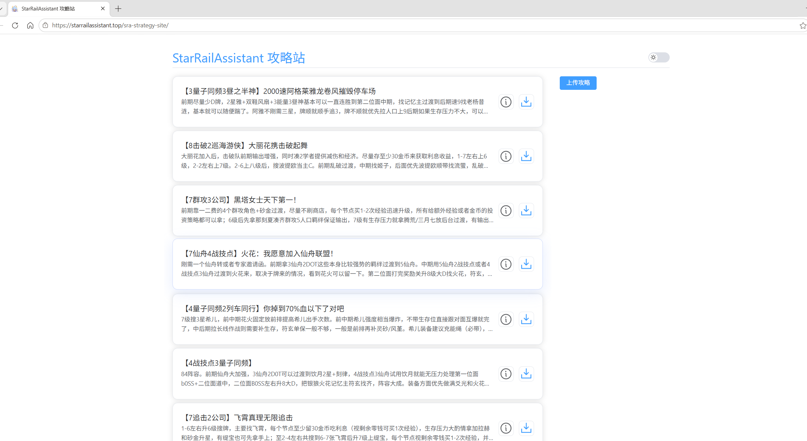

import { Steps } from "@astrojs/starlight/components";

## 在 SRA 中添加自定义货币战争攻略

本章节介绍如何在 SRA 中添加一个自定义货币战争攻略。

### 先决条件

- 已安装 SRA 或已获取 SRA 源码
- 了解 JSON 格式
- 文本编辑器（如 VSCode、Notepad++）

### 分步教程

<Steps>

1. 打开 SRA 的安装目录或源码目录，找到 `tasks` 文件夹。

   
   这里存放了所有的任务脚本。
   

2. 进入 `currency_wars/strategies` 文件夹。

   
   这里存放了所有的货币战争攻略文件。

3. 创建一个新的 JSON 文件，例如 `MyCustomStrategy.json`。

   名称不重要，只需要确保文件扩展名是 `.json` 即可。

4. 编写攻略基础信息。

   在你最喜爱的文本编辑器中打开 `MyCustomStrategy.json` 文件。输入以下内容：

   ```json
   {
     "title": "MyCustomStrategy",
     "description": "这是一个自定义的货币战争攻略",
     "author": "Your Name",
     "uploader": "Your Name",
     "share_code": "##Your Share Code=##"
   }
   ```

   `title`: 这是攻略的标题，用于在 SRA 中显示。
   `description`: 这是攻略的描述，便于用户了解攻略的功能。
   `author`: 为了保护作者的版权，建议在攻略中包含作者的呢称。
   `uploader`: 为了区分作者和上传者，建议在攻略中包含上传者的呢称。
   `share_code`: 如果你制作的攻略在官服攻略大全中有对应的分享码，将其填写在这里，以便指定推荐装备。

5. 编写攻略内容。

   接下来，你需要编写攻略的具体内容。
   例如，你可以添加以下内容：

   ```json
   {
     "min_coins": 40, // 最小金币保留数量，当金币数量少于这个数量时，SRA会跳过购买角色和提升等级
     "min_level": 6, // 最小等级要求，当等级低于这个值时，SRA会优先提升等级
     "mid_level": 9, // 中等等级要求，当等级低于这个值时，SRA会在购买角色中穿插提升等级
     "on_field": {
       // 前台角色字典
       "姬子·启行": 3, // 格式为 角色名: 星级
       "瓦尔特": 1, // 例如：这个键值对告诉SRA应该购买到1星瓦尔特
       "开拓者": 2, // 例如：这个键值对告诉SRA应该购买到2星开拓者
       "花火": 2, // 也可以把后台角色强制放到前台
       "星期日": 1,
       "丹恒·饮月": 2
       // 角色在字典中出现的顺序即为角色在场上的位置
       // 例如，如果想让"姬子·启行"在前台1号位，只需把她放到字典顶部
       // 如果攻略需要前期过渡阵容，越前期的角色越在底部。
     },
     "off_field": {
       // 后台角色字典
       "三月七": 2,
       "刻律德菈": 3,
       "符玄": 2,
       "千冶·刃": 2, // 角色顺序同时也是站位，例如当场上只有七个位置，但我们有八名角色时，千冶·刃会优先上场
       "缇宝": 2
     },
     "special_events": {
       // 特殊事件处理
       "领航员": "护盾" // 例如：当触发领航员羁绊时，SRA会选择”护盾“选项
     }
   }
   ```

6. 使用攻略。

   保存攻略文件后，你可以在 SRA 中使用它。
   你可以在 SRA 中打开 `旷宇纷争` 任务，下滑到 `货币战争` 的 `攻略` 部分，点击右侧刷新按钮，即可看到你添加的攻略。

7. 分享攻略。

   你可以在 SRA 中分享攻略，其他玩家可以使用你的攻略。
   你可以在 SRA 中打开 `旷宇纷争` 任务，下滑到 `货币战争` 的 `攻略` 部分，点击右侧攻略站按钮，将跳转到[攻略站](https://starrailassistant.top/sra-strategy-site/)，你可以分享你的攻略给其他玩家。
   
   上传你的攻略文件，即可分享给其他玩家。上传后需经过审核，审核通过后即可公开展示在攻略站中。

8. 导入攻略。

   你可以在 SRA 中导入其他玩家的攻略。
   转到[攻略站](https://starrailassistant.top/sra-strategy-site/)，选择你心仪的攻略，点击下载按钮，即可下载攻略文件。
   然后，将攻略文件放在 `currency_wars/strategies` 文件夹中，即可在 SRA 中使用。

9. 恭喜你！

   你成功地制作了一个添加了一个自定义的货币战争攻略。
   你可以在 SRA 中使用它，也可以分享给其他玩家。

</Steps>
